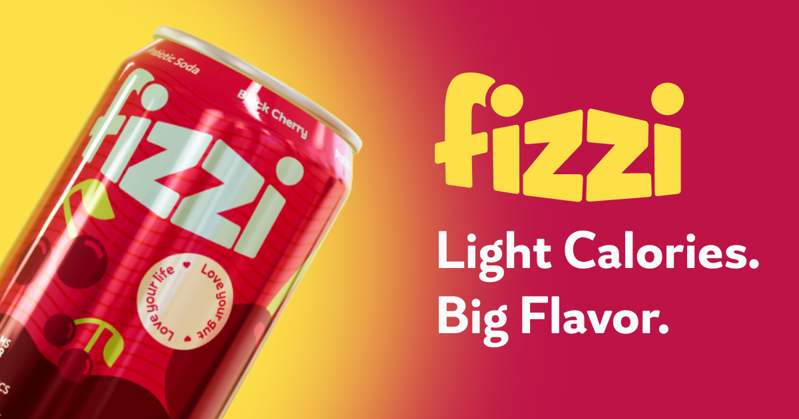

# 🥤 Fizzi — Animated Beverage Experience

A visually immersive landing page built using **Next.js**, **Prismic CMS**, **GSAP**, and **Three.js (React Three Fiber)** — based on the Prismic Minimal Starter.

This project transforms a minimal starter into a **highly interactive, animation-driven product experience**, featuring dynamic 3D drink models and smooth storytelling across the page.

---

## 🚀 Live Demo

👉 Soon

---

## 🧩 Starter Base

This project was originally scaffolded using the official:

👉 https://nextjs-starter-prismic-minimal.vercel.app/

The starter provides:

- Basic Next.js setup
- Prismic CMS integration
- Slice-based content structure

It has been **heavily extended and customized** to support advanced animations, 3D rendering, and a richer UI/UX.

---

## ✨ Overview

Fizzi is designed as a **motion-first landing page** that combines:

- Scroll-driven storytelling
- Real-time 3D rendering
- CMS-powered dynamic content

---

## 🧠 Key Features

### 🎬 Advanced Animations (GSAP)

- ScrollTrigger-based animations
- Timeline orchestration
- Smooth motion design

### 🧊 3D Drink Models (Three.js + R3F)

- 5 dynamic drink flavors
- Scroll-synced transitions

### ⚡ Next.js Performance

- Optimized rendering
- Lazy loading

### 📝 Prismic CMS

- Slice-based structure
- Dynamic updates

---

## 🛠️ Tech Stack

- Next.js
- Prismic CMS
- GSAP
- Three.js (R3F)
- Tailwind CSS / CSS Modules

---

## 📸 Preview



---

## 🧩 Project Structure

```
/components      → Reusable UI & animation components
/sections        → Page sections (Hero, Flavors, etc.)
/prismic         → CMS configuration & slices
/lib             → Utilities & helpers
/public          → Static assets (images, 3D models)
/styles          → Global styles
```

---

## ⚙️ Getting Started

```bash
git clone https://github.com/your-username/fizzi.git
cd fizzi
npm install
npm run dev
```

---

## 📈 What This Project Demonstrates

Advanced frontend architecture with Next.js
Real-world use of GSAP + ScrollTrigger
Integration of 3D experiences in UI
Clean separation between content and presentation
Building high-end interactive landing pages

---

## pages

🔮 Future Improvements
Mobile optimization for 3D rendering
Interactive controls (hover / drag)
Accessibility improvements (reduced motion support)
Expanded CMS flexibility

---

## 👨‍💻 Author

Hazem Tantawy
Senior Frontend Engineer — React / Next.js / Animation-driven UX

---

## 📄 License

This project is for portfolio and demonstration purposes.

---

## 🙌 Acknowledgements

Prismic for the starter and CMS platform
GSAP for powerful animation tooling
Three.js & React Three Fiber for 3D rendering
